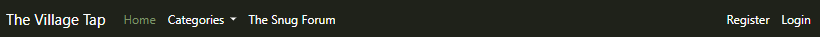
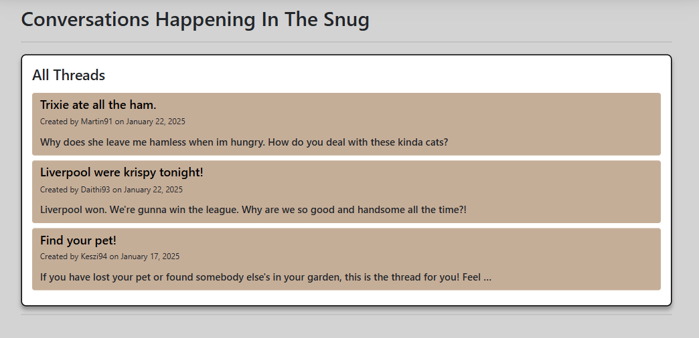
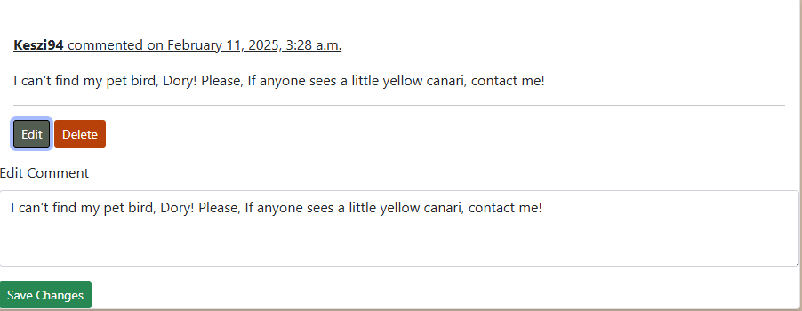
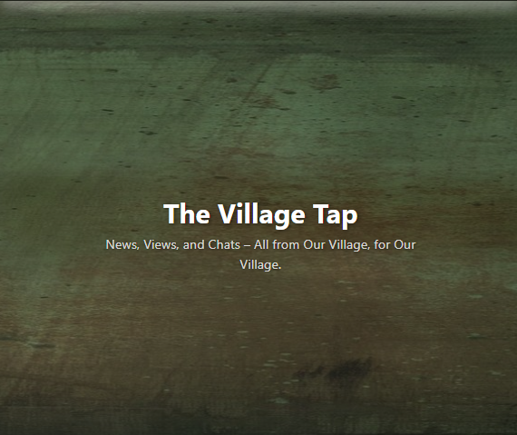

# The Village Tap

The village tap is a news site designed for the community of a small, fictional Irish village. 

The site is designed to provide the imagined community with up-to-date news about village happenings, including traffic updates, wedding announcements, and more. It also serves as a platform for engaging discussions on the site's articles, as well as an open forum for community members to share thoughts and seek opinions on various topics.

[Live link to the site](https://the-village-tap-74679d8f9977.herokuapp.com/)


## CONTENTS

* [User Experience](#user-experience)
     * [UX Design](#ux-design)

 * [Planning](#planning)
     * [Milestones and User Stories](#milestones-and-user-stories)
         * [Milestone 1 - Initial Setup](#milestone-1---initial-setup)
         * [Milestone 2 - Main Site Pages](#milestone-2---main-site-pages)
         * [Milestone 3 - Forum Access](#milestone-3---forum-access)
         * [Milestone 4 - CRUD Functionality](#milestone-4---crud-functionality)
         * [Milestone 5 - Additional](#milestone-5---additional)
   
* [Scope](#scope)
   
* [Structure](#structure)
   
* [Blueprint](#blueprint)
     * [Wireframe Models](#wireframe-models)
     * [Database Model](#database-model)

* [UI and Layout](#ui-and-layout)
     * [Implemented Features](#implemented-features)
     * [Features to be implemented](#features-to-be-implemented)
     * [Design](#design)

* [Tecnologies and Resources Used](#technologies-and-resources-used)

* [Testing](#testing)

* [Deployment & Local Development](#deployment--local-development)
     * [Heroku Deployment](#heroku-deployment)
     * [How to Fork](#how-to-fork)
     * [How to Clone](#how-to-clone)

* [Credits](#credits)
     * [Code Used](#code-used)
     * [Content](#content)
     * [Media](#media)
     * [Acknowledgments](#acknowledgments)


## User Experience

The platform offers an intuitive experience, allowing users to easily read articles, participate in forum discussions, and leave comments. Administrators have the ability to manage and create articles, moderate user content, and maintain a safe community environment through the admin dashboard. The interface is fully responsive, ensuring smooth navigation across all devices.


### UX Design
The UX design focuses on providing a seamless and intuitive experience for all users. The layout is clean and easy to navigate, ensuring that users can quickly find and engage with content. Key elements, such as articles and forum discussions, are prominently displayed to enhance accessibility. The design prioritizes responsiveness, adapting effortlessly across devices to ensure a smooth experience on both desktop and mobile. Clear calls to action and thoughtful interaction design guide users through the site, creating a positive and engaging environment.

### Milestones and User Stories

The project was structured around five milestones, each focusing on a different stage of devlopment. These milestones were broken down into development goals and user stories, prioritized using the MoSCoW method to ensure essential features were implemented first. More details on the project's progress and priorities can be found on te [@the_village_tap User Stories](https://github.com/users/Keszi94/projects/6) Kanban Board.

#### Milestone 1 - Initial Setup
- 1: Install and configure Django along with necessary libraries in the IDE to start development
- 2: Set up project and apps with the required structure and configurations
- 3: Deploy the project to Heroku with for early testing
- 4: Create an instance of a cloud-based PostgreSQL database and connect it to the project
- 5: Create a random secret_key and add it to the env.py file
- 6: Create and Setup The Forum App

#### Milestone 2 - Main Site Pages
- 1: Site Admin User Story: Add and manage news stories (back-end)
- 2: Site Admin User Story: Assign Categories to Articles
- 3: Site User User Story: View a news article
- 4: Site User User Story: View the Homepage
- 5: Site User User Story: News Categories

#### Milestone 3 - Forum Access
- 1: Site User User Story: Account Registration
- 2: Site User User Story: View "The Snug" forum page

#### Milestone 4 - CRUD Functionality
- 1: Site Admin User Story: Make the text area for news editing intuitive
- 2: Site Admin User Story: Thread Creation From Front-end
- 3: Site Admin User Story: Creating new articles from the main page
- 4: Site User User Story: Thread Creation
- 5: Site User User Story: Threads edit and deletion
- 6: Site User User Story: Commenting in "The Snug" Forum
- 7: Site User User Story: Edit and Delete Comments

#### Milestone 5 - Additional
- 1: Dev: Automatically Created Forum Threads for New Articles
- 2: Site Admin User Story: Review & Handle News Suggestions
- 3: Site Admin User Story: Add New Category If Needed
- 4: Site User User Story: News Suggestions


## Scope
Guided by the milestones, goals, and user stories, the following features and functionalities were planned:

* Responsive Design:
   
   Ensures full functionality and proper resizing across all devices, starting from 360px width upwards.

* Mobile/Tablet Optimization:
   
   Utilizes a toggle-menu and hidden elements (e.g., home page image) to improve site viewing on mobile and tablet devices.

* Public Section (Non-Restricted Access):
  
  A dedicated section of the site for general information, accessible by all users:
   * Village News & Announcements
   * Event Listings
   * General Articles

* User Interaction Section (Restricted Access):
  
  A space for community members to interact, including CRUD (Create, Read, Update, Delete) functionalities for user accounts and participation:
   * User Registration/Sign In/Out
   * Create and Edit Forum Posts
   * Comment on Articles
   * Participate in Discussions

* Admin Section (Restricted Access):
  
  A secure admin backend to manage site content and user interactions, including CRUD functionalities for site administrators:
   * Manage Articles (Create, Edit, Delete)
   * Moderate Comments and User Contributions
   * View and Manage User Accounts
   * Ensure Site Safety and Content Quality

## Structure

With the Strategy and Scope clearly defined, the next step was to structure the site in a way that ensures intuitive navigation and functionality. To achieve this, clear acceptance criteria were established for each feature, ensuring that every componennt aligned with user needs and project goals. This structured approach guided developement and provided a framework for maintaning usability, accessibility and responsiveness across all devices.

The website is organised into three main sections: 

* Public Section (Accessible to all users):
   * Display all available articles eith all their content.
   * Provides Articles are categorised for easy browsing, which allows users to quickly find the content they are looking for.
   * Designed to be engaging and useful even for visitors who are not registered.

* User Interaction Section (Rgistered users only)
   * Enables community engagement through participation in forum discussions.
   * Allows users to create, edit, and delete forum posts and comments, providing an interactive space for community conversations.
   * A simple and accessible authentication system allows users to register. log in and log out.

* Admin Section (Administrators only)
   * A secure backend dashboard provides tools to manage site content and user interactions.
   * Includes CRUD functionalities for news articles and forum posts.
   * Moderation tools ensure content quality and a safe discussion environment.
   * A front-end NavLink to the "Create New Article" page is only visible to logged-in admins.


## Blueprint

Before development began, wireframes were created to outline the site's layout and user flow. These provided a visual guide for how key features, such as navigation, forum discussions, and news articles, would be structured and presented. In addition, a database schema was designed to define how data would be organized and interconnected within the project. Taking the time to plan both the interface and data flow ensured a more efficient and structured approach to development.

### Wireframe Models

#### Main Site Pages

1. Home
  
 * Article detail pages 


2. The Snug Forum
 
 * Thread detail pages


#### Authorisation Pages

* Register
* Sign in 
* Sign out


#### Create New Article Page (For Administrators only)


### Database Model

The database for this project is built around Django’s built-in User model, which handles authentication. Everything else - articles, forum threads, and comments - connects back to users in a one-to-many relationship. This basically means that one user can write multiple articles, start multiple forum threads, and leave multiple comments, but each article, thread, or comment belongs to just one user.

There’s also a connection between threads and articles, so discussions in the forum can be linked to news posts if needed. This is optional, threads do not have to be tied to an article at all.

The diagram below lays out how everything is connected in the database.


## UI & Layout

With the wireframes and database structure sorted, the site was put together using Django, HTML, CSS, and JavaScript to bring all the planned features to life. Each page was built to match the original idea while making sure everything was responsive and easy to use. Below are screenshots showing how the final version of the site turned out.

### Implemented Features

The following features were developed based on the project’s goals and user needs. Each one was designed to enhance functionality and improve user experience, ensuring the site is both practical and engaging. Details for each feature are provided below.

#### Navbar and Toggler

* A clearly visible navbar appears on all pages, making navigation simple and consistent across the site.
* Includes links to Home, The Snug (Forum), and Register/Login, giving users quick access to key areas.



* A Categories dropdown lets users filter articles by topic, making it simple to find specific news sections.


* The navbar automatically switches to a collapsible toggler menu on smaller screens to keep things looking neat.


* If an admin is logged in, a "Create New Article" link appears, allowing them to quickly access the article creation page. Regular users don't see this option.


#### Footer

* Stays at the bottom of every page, making sure users always have quick access.
* Links to social media (Facebook, Twitter, Instagram, YouTube) so users can stay updated.
* Uses Font Awesome icons for a clean look instead of plain text links.
* Dark background for contrast, making it easy to read and stand out.
* Fully responsive, so it looks good on both big screens and mobiles.


#### Home Page

* Features a large header image to set the tone and make the page visually appealing.
* Brief introduction over the header to let visitoors know what the site is about.
* Easy navigation with category buttons on each article card, so that the user does not have to choose scroll up to the navbar to choose a category of interest.


#### Article Detail Pages

* Displays the full article, including title, author, and publication date at the top.
* Category buton lets users quickly find more articles from the same category.


* Includes the short summary (blurb) that is seen on the homepage.
* Full article content is shown, formatted for easy reading.
* If sources are provided, they appear at the bottom of the article.


#### The Snug Forum Page

* If the site user is not logged in, they can not view posted threads. 


* All approved threads are displayed, showing the title, author, and a short description.
* Threads are sorted by most recent so users see the latet discussions first.



* Thread creation:
  
   * Users can create a new thread by filling out a form on the bottom of the page.

   

   * Threads created by regular users require admin approval before appearing publicly, which they get a message about on the top of the page.
   * Admins can post threads immediately without needing approval.


#### Thread Details Pages

* Displays the full thread content, including the title, description, and author.
* Users can participate in discussions by leaving comments.


1. Thread Editing page
     
  * Thread authors can edit thir own threads, making updates or corrections when  needed.
  * When the user clicks on the edit thread button, it opens a seperate page with an edit form that has prepopulated fields.
  * If the user clicks on the Cancel button, they will be redirected to the thead detail page.

   

2. Thread Deletion
  
  * Thread authors can delete their own threads if they decide they no longer want them to be on the site.
  * Admins can remove any thread to moderate discussions through the admin panel.
  * A confirmation prompt appears before deletion.

  
     
3. Comment Editing

  * Users can edit their own comments if they need to fix typos, change what they said.
  * JavaScript makes editing smoother by letting users edit comments without refreshing the page or going to a seperate page for the form.

    
    
4. Comment Deletion
  
  * Users can delete ther own comments if they want to remove them from a thread.
  * Admins can delete any comment through the admin panel if needed for moderation.
  * A confirmation  popup appears with the help of JavaScript, maing sure users don’t accidentally delete a comment.

  


#### Register, Sign In/Out

* Users can create an account to access interactive features like commenting and posting in the forum.
* The Sign In page lets users log in securely, so they can participate in discusions.
* A Sign Out option is available for users to log out when they're done.
* Django AllAuth handles authentication, ensuring a smooth and secure login process.
* Forms are simple and easy to use, keeping the process quick.


#### Admin Panel

* Only accessible to site administrators via /admin (not linked anywhere on the site).
* Requires login credentials, restricting access to authorized admins only.
* Admins can manage:
   * Articles (Create, Edit, Delete, Approve).
   * Comments (Moderate, Delete).
   * User accounts (Manage permissions if needed).
* A simple interface allows easy moderation and content updates without direct database access.


* Content is organized for easier management:
   * Threads can be filtered by: slug, status (pending/approved), and creation date.
   * Articles are displayed with categories, authors, and publication status.
   * Comments are listed under their related threads for quick moderation.

  
  


### Features To Be Implimented

While the site currently includes a range of features, there are still several planned improvements that were not yet implemented due to time constraints.
All of these missing features can be found on my [project board](https://github.com/users/Keszi94/projects/6), inside the ignored column.

* Automatically Created Forum Threads for New Articles
   
   * When a new article is published, a corresponding thread should be automatically created in "The Snug" forum. This would allow users to discuss the latest news without having to create a thread manually.

* Review & Handle News Suggestions (Admins)
   
   * Admins should have a way to review news suggestions submitted by users and decide whether to turn them into articles.

* News Suggestions (Site Users)
   
   * Users should be able to suggest news stories by filling out a form on the site. This would allow them to contribute ideas for new articles.

* Add New Categories (Admins)
  
   * Admins should be able to add new categories for articles, so the site can cover different topics as needed.

* Article Pagination
   
   * The main page currently displays all published articles at once, making it one long list with no limit. A pagination system was planned so users could navigate between pages using "Next" and "Previous" buttons.

### Design

The design takes inspiration from old, worn wooden surfaces, much like the faded tables of a traditional pub. Since the website name plays on the idea of getting your news at the pub, the visual style reflects that warm, rustic feel.

The forum, The Snug, builds on this theme, playing on the idea of pub snugs, where people gather in cozy corners to share the juiciest gossip in peace. To reinforce this, the site uses two different color palettes:

* Home Page Palette – A cool, deep green tone, giving a classic, slightly moody pub feel:




* Forum Palette – A warmer, brownish tone, reflecting the cozy, intimate atmosphere of a snug corner:


Both pages share the same light grey background, tying everything together while letting the headers define the space.


## Tecnologies and Resources Used

### Tecnologies

In order to code and design the website, the following technologies were utilised:

* Python Modules:
  * Django==4.2.17
  * django-allauth==0.57.2
  * django-crispy-forms==2.3
  * crispy-bootstrap5==0.7
  * django-summernote==0.8.20.0
  * dj-database-url==0.5.0
  * dj3-cloudinary-storage==0.0.6
  * cloudinary==1.36.0
  * psycopg2-binary==2.9.10
  * sqlparse==0.5.3
  * requests-oauthlib==2.0.0
  * python3-openid==3.2.0
  * PyJWT==2.10.1
  * oauthlib==3.2.2
  * whitenoise==5.3.0
  * gunicorn==20.1.0
  * django-extensions==3.2.3


* Django
    * The framework used to build the website and manage data.


* Heroku
   * The platform used to deploy and host the site. 


* Bootstrap
   * Used to style the website and make it responsive.


* CSS
   * Adds custom styling to the site’s design. 


* JavaScript
   * Used for handling comment edits and deletions with confirmation popups.


* CI Database Maker
   * Stores and manages the website’s data.

* dj3-cloudinary-storage & cloudinary
   * Used to store, manage, and serve images for articles and user uploads eficiently.


## Testing

All documentation regarding the testing on this project can be viewed in this seperate [TESTING.md file](TESTING.md).

## Deployment & Local Development

### Heroku Deployment

This site is deployed to and currently hosted on the Heroku platform. The steps for deploying to Heroku with a custom PostgreSQL database setup are as follows:

1. PostgreSQL Database Setup
 * Navigate to [PostgreSQL from Code Institute](https://dbs.ci-dbs.net/).
 * Enter your student email address in the input field provided.
 * Click Submit.
 * Wait while the database is created.
 * Once the database is successfully created, check your student email inbox for further details.

2. Django Project Settings

* In the project workspace, navigate to/create a file named Procfile (remember the capital 'P'). Add the following code (replace <myapp> with your actual app name) and save the file:
  ```makefile
  web: gunicorn <myapp>.wsgi
   ```
* Now, create a file named env.py and add the following code, replacing <myurl> with your database URL and <mykey> with a secret key string. Save the file:
  ```python
  import os

  os.environ["DATABASE_URL"] = <myurl>
  os.environ["SECRET_KEY"] = <mykey>
  ```
* Open settings.py and add the following imports near the top of the file:
  ```python
  import os
  import dj_database_url
  if os.path.isfile('env.py'):
    import env
  ```
* Replace the SECRET_KEY and DATABASES variables with the following:
  ```python
  SECRET_KEY = os.environ.get('SECRET_KEY')

  DATABASES = {
      'default': dj_database_url.parse(os.environ.get("DATABASE_URL"))
  }
  ```
* Save the file, then run ```python manage.py migrate``` in the terminal to apply any database migrations.

3. Push Changes to Repository
 * Commit and push these changes to the repository to update your project.

4.  Heroku Setup
* Navigate to Heroku and log in or create an account.
* Click "New" in the top right and select "Create New App."
* Enter a unique app name, choose a region, then click "Create app."
* Go to the "Settings" tab and click "Reveal Config Vars." Add the following:
     * ```DATABASE_URL```: Your database URL from the previous setup.
     * ```SECRET_KEY```: Your secret key.
     * ```PORT```: 8000 (default port for Heroku apps).
* Go to the "Deploy" tab, select "GitHub" under "Deployment method," and connect your repository.
* Scroll down and click "Deploy Branch" to complete the deployment process.


### How to Fork

1. Log in to your GitHub account.
2. Navigate to the ['The Village Tap' GitHub repository](https://github.com/Keszi94/the-village-tap).
3. In the top right corner of the page, click the "Fork" button.
4. Select your GitHub account or organization where you want to fork the repository.
5. You now have a copy of the repository in your own account to make changes.

### How to Clone
1. Log in to your GitHub account.
2. Navigate to the ['The Village Tap' GitHub repository](https://github.com/Keszi94/the-village-tap).
3. Click on the "Code" button and ensure "HTTPS" is selected.
4. Copy the repository URL.
5. Open your terminal/command line, navigate to the folder where you want to clone the project, and run:
```python
git clone <repository-url>
```

## Credits

### Code Used

* During development, I watched several YouTube videos on Django to deepen my understanding:
   
   * [Python Django Web Framework - Full Course for Beginners](https://www.youtube.com/watch?v=F5mRW0jo-U4&ab_channel=freeCodeCamp.org)
   * [Django Mastery : Build 5 Websites in 5 Hours | Beginner to Advanced Tutorial](https://www.youtube.com/watch?v=hWhWdf2gsfQ&ab_channel=ErrorByNight)
   * [Python Django Full Course for Beginners | Complete All-in-One Tutorial | 3 Hours](https://www.youtube.com/watch?v=Rp5vd34d-z4&ab_channel=DaveGray)

* I have used various bootstrap templates to get the styling of certain elements in my project:

   From [Start Bootstrap](https://startbootstrap.com/) : [Clean Blog](https://startbootstrap.com/theme/clean-blog) | [Agency](https://startbootstrap.com/theme/agency)
   
* Throughout development, I have followed the steps of the Code Institute 'Django Blog' walkthrough project as a guide

* I have used the following websites to gather relevant information during my research:

   * [Reddit](https://www.reddit.com/?rdt=51547)
   * [W3Schools](https://www.w3schools.com/)
   * [Bootstrap](https://getbootstrap.com/)
   * [Stack Overflow](https://stackoverflow.com/questions)
   * [Codu](https://www.codu.co/)
   * [Django](https://www.djangoproject.com/)
   * [MDN web docs](https://developer.mozilla.org/en-US/)

### Content

* I used [ChatGPT](https://chatgpt.com/) to create the fictional articles on the website.
* I created my Readme file based on [ndsurgenor's](https://github.com/ndsurgenor) [EastSt.](https://github.com/ndsurgenor/east-street/blob/main/README.md) Readme file.

### Media

* All of the images used for the articles were downloaded form [Pexels](https://www.pexels.com/hu-hu/):
  
   * [Khunkorn Laowisit](https://www.pexels.com/hu-hu/foto/1211793/)
   * [Bara Cross](https://www.pexels.com/hu-hu/foto/220694/)
   * [John-Mark Smith](https://www.pexels.com/hu-hu/foto/250716/)
   * [Erik Scheel](https://www.pexels.com/hu-hu/foto/szemely-aki-gyumolcsot-ad-egy-masiknak-95425/)
   * [Elle Hughes](https://www.pexels.com/hu-hu/foto/elelmiszer-etel-etterem-ferfi-2696064/)
   * [Tirachard Kumtanom](https://www.pexels.com/hu-hu/foto/347135/)
   * [Irina Anastasiu](https://www.pexels.com/hu-hu/foto/54512/)
   * [ezgi yalçın](https://www.pexels.com/hu-hu/foto/elegans-eskuvoi-portre-rusztikus-dekoracio-alatt-30457602/)

* Wireframes for the Readme were created on [Moqups](https://app.moqups.com/)

* I created the favicons for the website on [favicon.io](https://favicon.io/)

* The ER diagram was created on the [Lucidchart App](https://lucid.app/documents#/home?folder_id=recent) website

* I sourced the home page header image from [pixaby](https://pixabay.com/) and then recolored it for the forum page

* The gif for the Readme was captured using [LICEcap](https://www.cockos.com/licecap/)

### Acknowledgments


I would like to acknowledge the following people who helped me along the way in completing this project:

* My Code Institute mentor, [Graeme Taylor]((https://github.com/G-Taylor)). Thank you for the continuous guidance and support.


