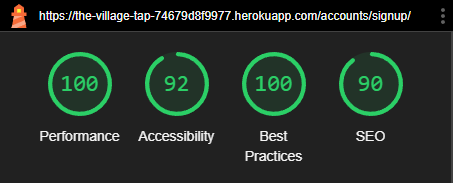

# Testing: The Village Tap

## Table of Contents

* [Manual Testing](#manual-testing)
     * [Navigation](#navigation)
     * [Responsiveness](#responsiveness)
     * [Authentication](#authentication)
     * [CRUD Functionality](#crud-functionality)

* [Validator Testing](#validator-testing)
     * [PEP8](#pep8)
     * [W3C](#w3c)
     * [JSHint](#jshint)

* [Accessibility and Performance](#accessibility-and-performance)
     * [WAVE](#wave)
     * [Lighthouse](#lighthouse)

* [Bugs and Bug Fixes](#bugs-and-bug-fixes)

## Manual Testing

### Navigation

**Test**|**Steps**|**Expected**|**Result**
-----|-----|-----|:-----:
Location page displays when using navbar link|Enter website URL in browser|Home page loads correctly|Pass
Home page loads when clicking 'Home' in navbar|Click 'Home' in the navbar|Directs to Home page|Pass
Home page loads when clickin on The Village Tap title|Click on the title|Directs to Home page|Pass
Dropdown menu with all categories listed displays when clicking on category|Click 'Categories' in the navbar|Dropdown expands and shows category options|Pass
Selecting 'General News' displays all articles in that category|Click on 'Categories' dropdown, then select 'General News'|Directs to category page displaying all 'General News' articles|Pass
Selecting 'Traffic' displays all articles in that category|Click on 'Categories' dropdown, then select 'Traffic'|Directs to category page displaying all 'Traffic' articles|Pass
Selecting 'Obituaries' displays all articles in that category|Click on 'Categories' dropdown, then select 'Obituaries'|Directs to categry page displaying all 'Obituaries' articles|Pass
Selecting 'Wedding Announcements' displays allarticles in that category|Click on 'Categories' dropdown, then select 'Wedding Announcements'|Directs to category page displaying all 'Wedding Announcements' articles|Pass
Selecting 'Village History' displays all articles in that category|Click on 'Categories' dropdown, then select 'Village History'|Directs to category page displaying all 'Village History' articles|Pass
Selecting 'Village Achievements' displays all articles in that category|Click on 'Categories' dropdown, then select 'Village Achievements'|Directs to category page displaying all 'Village Achievements' articles|Pass
Forum page loads when clicking 'The Snug Forum'|Click 'The Snug Forum' link|Directs to Forum page|Pass
Clicking on an article opens the correct article page|Click on a article from the homepage|Redirects to correct article|Pass
Clicking on a thread opens the correct thread page|Click on a thread from the forum page|Redirects to correct thread|Pass
Admin panel loads when accessing /admin (admin only)|Manually enter '/admin' in URL (must be admin)|Admin panel requires login|Pass
Clicking on 'Create New Article' redirets to article form (admin only)|Click 'Create New Article' in navbar (must be admin)|Redirects to article creation page|Pass
Clicking 'Sign Out' directs uer to confirmation page|Click 'Sign Out' in the navbar|User is directed to a confirmation pag|Pass
Social media links open in new tab|Click any social media icon in footer|External site opens in new tab|Pass

### Responsiveness

**Test**|**Steps**|**Expected**|**Result**
-----|-----|-----|:-----:
Website displays correctly on 360px mobile view|Resize  browser to 360px width|Website scales correctly without issues|Pass
Website adapts to 768px tablet view|Resize browser to 768px width|Website adjusts layout properly|Pass
Website scales correctly on desktop (1080px)|Resize browser to 1080px width|Website maintains layout at full size|Pass
Navbar collapses into toggler menu on mobile|Shrink window until navbar collapses|Navbar collapses as expected|Pass
Navbar dropdwn for categories functions on mobile|Try openig category dropdown on mobile|Dropdown functions correctly|Pass
All buttons remain clickable on mobile|Click all buttons on mobile to ensure they work|All buttons remain clickable|Pass
Forum threads remain readable on mobile|Open forum page and check thread layout on mobile|Threads remain readable|Pass
Articles maintain layout when resized|Open article page and check layout when resized|Articles maintain readable format|Pass
Footer remains visible and does not overlap content|Scroll to footer and check positioning|Footer remains properly positioned|Pass
Forms (logn, register, create post) resize correctly|Open login/register forms and resize browser|Forms resize without breaking layout|Pass
Article images resize without distortion|View artices with images and resize window|Images scale without distortion|Pass
Forum thread descriptions do not get cut off|View forum thread descriptions and resize window|Thread descriptions remain readable|Pass

### Authentication

**Test**|**Steps**|**Expected**|**Result**
-----|-----|-----|:-----:
Sign up page loads successfully|Navigate to '/accounts/signup/'|Sign-up page loads successfully|Pass
Valid regitration creates a new user|Fill out the sign-up form and submit|New user account is created|Pass
Invalid registration (e.g., mismatched passwords) shows error|Attempt to register with invalid inputs|Error message displayed|Pass
Valid login redirects user properly|Enter correct username and password, submit|User lgs in successfully|Pass
Invalid login (wrong credentials) shows error message|Enter incorrect credentials, submit|Error message displayed|Pass
Admin-only pages are blocked for regular users|Log in as a regular user and try accessing '/admin/'|Access is denied|Pass
Logged-out users are told log in when trying to access restricted pages|Log out and try accessing a restricted page (Forum page)|page content does not display, messaging shows prompting login|Pass
Clicking 'Sign Out on sign out confirmation page logs user out and redirects to home|Click 'Sign Out' on the sign out page|User is logged out and redirected|Pass

### CRUD Functionality

**Test**|**Steps**|**Expected**|**Result**
-----|-----|-----|:-----:
Admin can create a new article|Log in as admin, go to 'Create Article', fil out and submit|New article appears on site|Pass
Created articles appear on the homepage|Check homepage for the new article|Article is visible on homepage|Pass
Admin can edit an existing article|Log in as admin, go to '/admin', find the article, edit fields, and save|Article updates successfully|Pass
Edited article updates correctly on site|Check if edited article updates on homepage|Edited article appears correctly|Pass
Admin can delete an article|Log in as admin, go to '/admin', find the article, delete it|Article is removed|Pass
Deleted articles no longer appear on site|Refresh homepge and check if article is gone|Article no longer appears|Pass
User can create a new forum thread|Log in as user, open forum, click 'Create Thread', fill form, submit|New thread appears on site|Pass
User cannot create an empty thread|Try submitting a thread form without filling required fields|User should be prevented from submitting an epty thread|Pass
Created forum treads appear in forum list|Refresh forum and check if new thread appears|Thread is visible on forum|Pass
Thread author can edit their thread|Log in as thread author, open thread, click 'Edit', make changes, submit|Thread updates successfully|Pass
Edited thread updates correctly|Check if edited thread updates in forum|Edited thread appears correctly|Pass
Thread author can delete their thread|Log in as thread author, open thread, click 'Delete'|Thread is removed|Pass
User can comment on a thread|Log in as user, open thread, add comment, submit|Comment appears under thread|Pass
User cannot submit an empty comment|Try submitting a comment with empty content|User should be prevented from submitting an empty comment|Pass
Comment author can edit their comment|Log in as comment author, edit comment,submit|Comment updates successfully|Pass
Comment author can delete their comment|Log in as comment author, delete comment|Comment is removed|Pass
User receives confirmation before deleting a commentor thead|Click 'Delete' on a comment or thread and check for a confirmation popup|User should see a confirmation prompt before deleting|Pass
Atach image when creating an article|Log in as admin, go to 'Create Article', fill out form, attach an image, and submit|Image should upload and displayin the article|Fail – Image does not upload, only default image displays on article

## Validator Testing

### PEP8

All Python files in the forum and news apps, as well env.py and manage.py and settings.py have been passed through the Code Institute [PEP8](https://pep8ci.herokuapp.com/#) Linter.
All issues raised have been corrected, no more warnings for any of the python files.

### W3C

All pages have been passed through the [W3C HTML Validator](https://validator.w3.org/) successfully save for one info being raised which have been left in the code:
* "Trailing slash on void elements has no effect and interacts badly with unquoted attribute values.

### JSHint

The comments.js file has been passed through [JShint](https://jshint.com/) with one issue raised: 
* "Functions declared within loops referencing an outer scoped variable may lead to confusing semantics. (bootstrap)"

## Accessibility and Performance

### WAVE

The site has been tested using the [WAVE Evaluation Tool](https://wave.webaim.org/) to ensure best practices have been followed regarding aria labels, heading hierarchy, and contrast between page elements.
The following issues were revealed and then left unfixed:

1. Home page:

* Contrast Errors for header texts - WAVE did not into account that the text is over a darker background image so it compares the contrast to the light-grey background.
* Alerts - Skipped heading level - On the Article display cards there is an h2 and an h4 heading without an h3 between them. the choice to leave it as it is was made for stylistic consistency. Since the structure remains clear and logical for users, and the skipped level does not negatively impact usability, this was an intentional decision.

2. The Snug page:

* Contrast Errors for header texts - WAVE did not into account that the text is over a darker background image so it compares the contrast to the light-grey background.

### Lighthouse

Lighthouse was used to used to produce reports on performance and accessibility for both desktop and mobile versions of the site.
The first image displayed on the lest under each page name is the test result of the mobile device load performance.

* Home page:

* The Snug:

* Edit Thread:

* Thread Detail:

* Sign in

* Sign out

* Register

## Bugs and Bug Fixes

1. 'The snug' forum page had no url path in the main urls.py file. 

      Added the missing URL path in the main urls.py so the forum page is actually accessible. Before this, it just wasn’t showing up at all.

2. Modify  threads_page view so superuser can create and post threads from front-end without needing approval.

      Updated the threads_page view so if an admin posts a thread, it gets automatically approved instead of needing manual approval.

3. Thread model required a manual slug.

      Modified the Thread model so the slug is automatically generated from the title. Now, users don’t have to enter it themselves.

4. Related article link wasn’t showing up in threads.

      Adjusted the template so the related article URL actually displays under the thread. Before this, the data was there, but it wasn’t being shown.

5. Logged-out users could stillsee forum threads.

      Updated threads_page.html to hide threads from logged-out users. Now, logged out users won’t see any forum content.

6. Fix NameError by prperly referencing and importing CATEGORY_CHOICES in article_list view.

      The CATEGORY_CHOICES variable wasn’t properly imported, so Django was throwing a NameError. Fixed the import, and now it works as expected. 

7. Incorrect URL matching order in news/urls.py.

      Some URLs were being matched out of order, so Django was routing requests incorrectly. Fixed the sequence so everything points to the right views.

8. 'Add New Article' link was visible to non-admins.

      Added an  condition in base.html to only show the link to superusers, preventing regular users from seeing it.

9. Edit thread form was displaying automatically insead of waiting for a button click.

      The JavaScript and HTML weren’t properly linked, so the form was showing up by default. Fixed it so the edit form only appears when the edit button is clicked.

10. Related article link was not clickable.

      The link was just being displayed as plain text instead of an actual hyperlink. Wrapped it in an 'a' tag so users can click it properly.

11. Redirect not previously imported in views.py.

      The redirect function was missing from imports, causing an error when trying to redirect users. Simply added from django.shortcuts import redirect, and it worked.

12. Non-admins could access the 'Create Article' page.

      Added a decorator to the create_article view so only superusers can access it. If a regular usser tries, they get redirected to the login page instead.

13. Edited thread submission wasn't working due to a pathing issue.

      The pathing issue was making it impossible to submit an edited thread correctly, I would get a 404 error every time. After trying to fix the broken structure for way too long, I have decided to create a completely separate edit_thread.html form and removed the JavaScript handling. Now, edits are submitted properly without any routng errors.